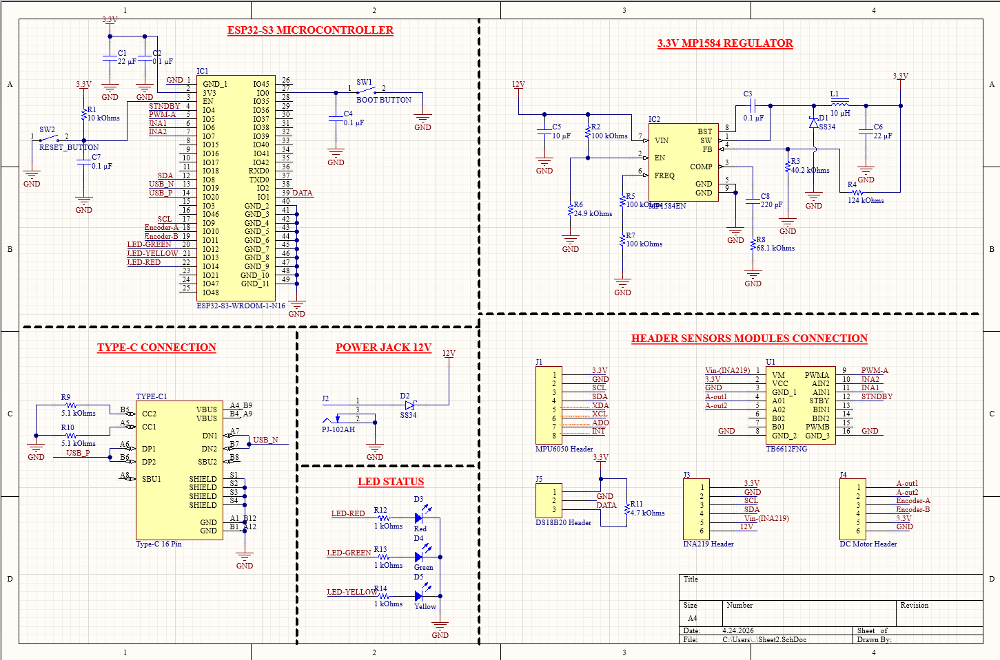
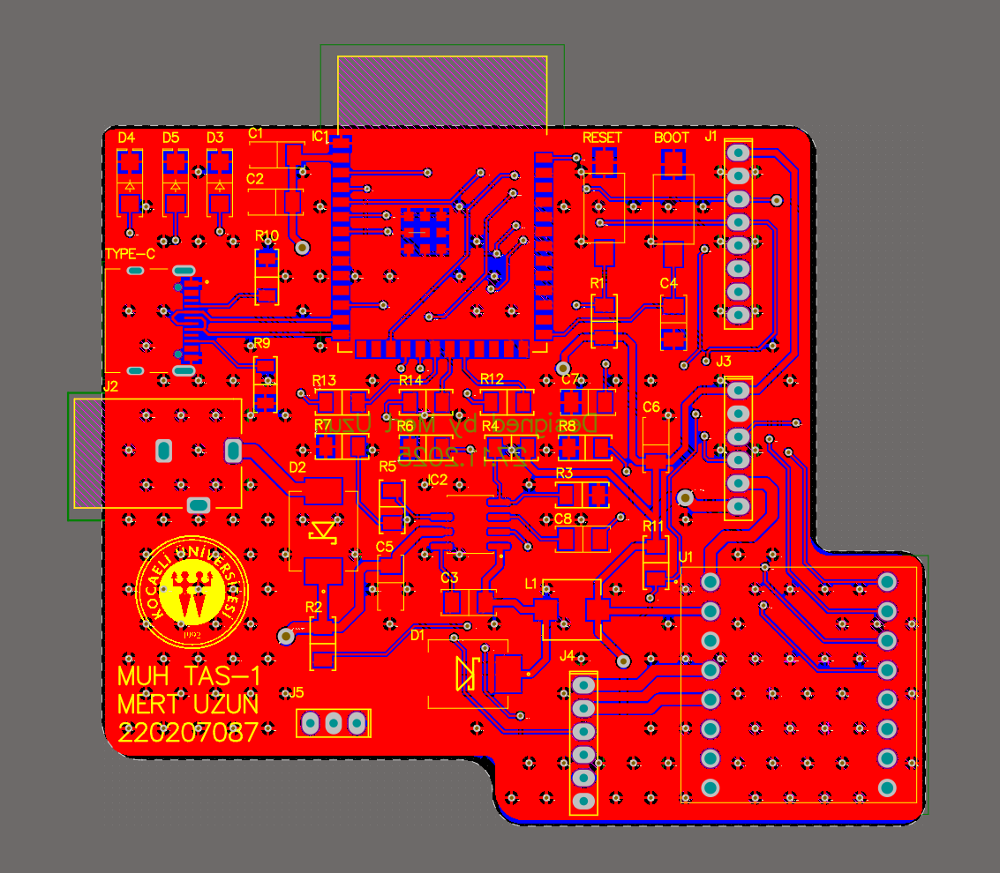
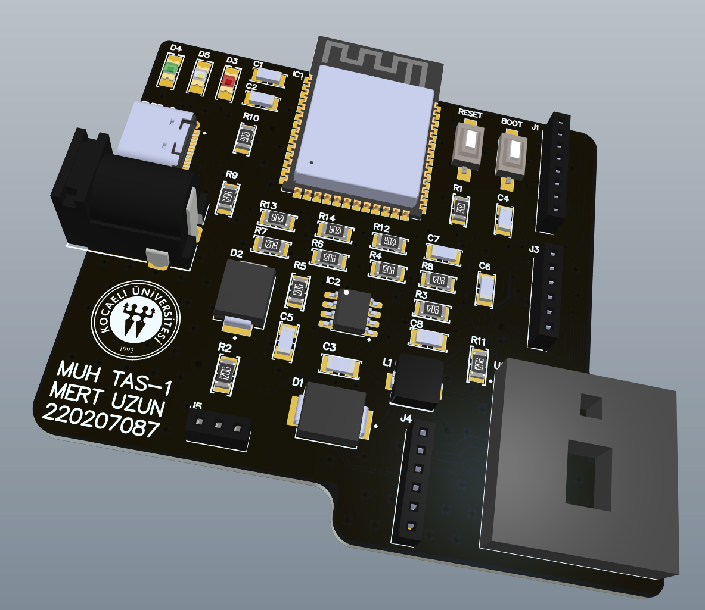
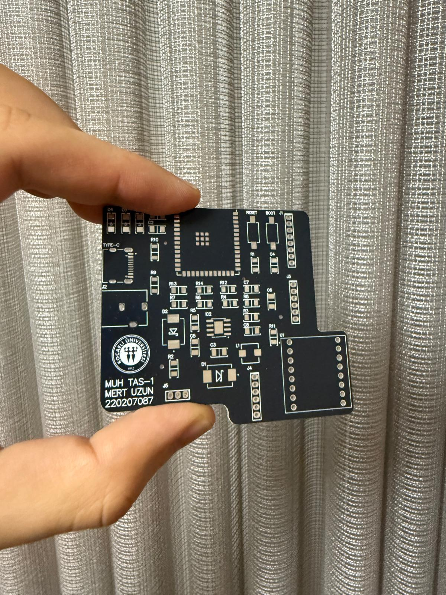
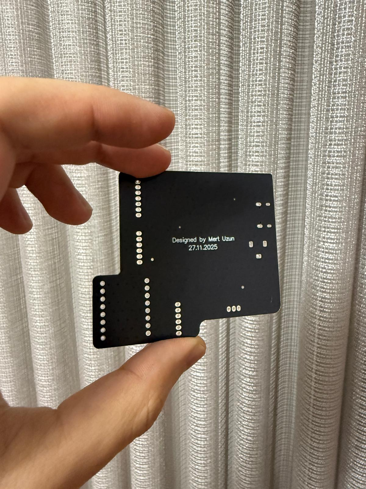
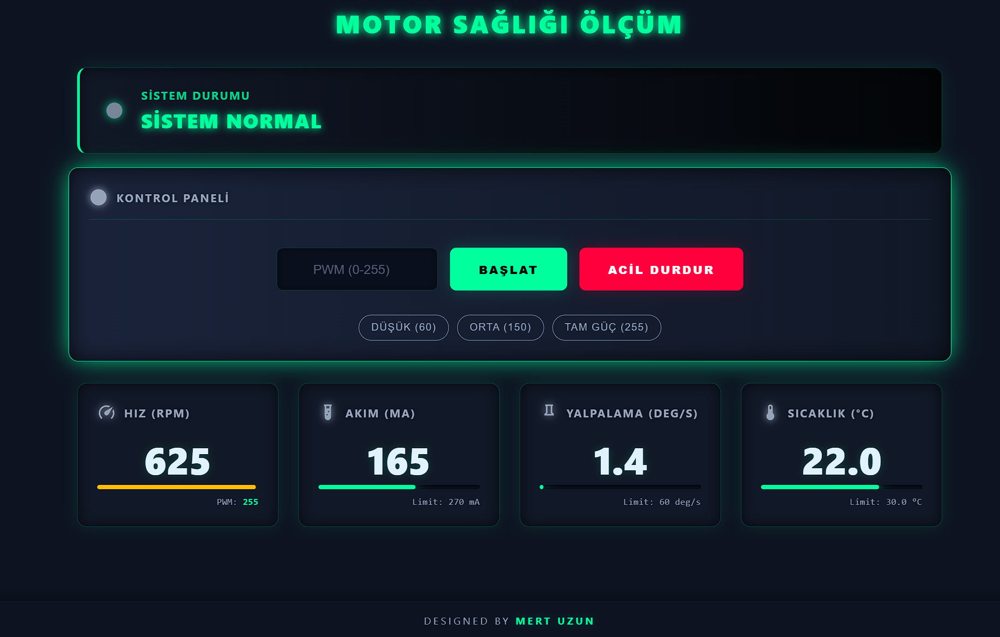

<div align="center">

# 🔧 Kestirimci Motor Sağlık İzleme Sistemi


*IoT tabanlı, ESP32-S3 ile motor arızalarını gerçek zamanlı tespit eden akıllı izleme sistemi*

</div>

---

## 📌 Proje Hakkında

Bu proje, elektrik motorlarının **titreşim**, **akım/voltaj** ve **sıcaklık** verilerini anlık olarak izleyerek olası arızaları önceden tespit etmeyi amaçlamaktadır. Verilere cihaza gömülü web arayüzü üzerinden uzaktan erişilebilir.

---

## ⚙️ Donanım

| Bileşen | Görev |
|--------|-------|
| ESP32-S3 | Ana mikrodenetleyici |
| MPU6050 | Titreşim ölçümü |
| INA219 | Akım / Voltaj ölçümü |
| DS18B20 | Sıcaklık ölçümü |
| TB6612FNG | Motor sürücü |

---

## ✨ Özellikler

- ⚡ Gerçek zamanlı sensör verisi işleme
- 🌐 Cihaza gömülü web arayüzü (WebSocket)
- 🖨️ Özgün PCB tasarımı ve üretimi
- 📡 Kablosuz uzaktan izleme

---

## 🚀 Kurulum

```bash
# 1. Arduino IDE'ye ESP32 kütüphanesini ekle
# 2. Kodu yükle
# 3. Aynı WiFi ağına bağlan
```

Tarayıcıdan `192.168.4.1` adresine git → Web arayüzü açılır.

---

## 🖼️ Görseller

### 📐 Şematik


---

### 💻 PCB Tasarımı

<table>
  <tr>
    <td align="center"><b>2D Görünüm</b></td>
    <td align="center"><b>3D Görünüm</b></td>
  </tr>
  <tr>
    <td></td>
    <td></td>
  </tr>
</table>

---

### 🏭 Üretim

<table>
  <tr>
    <td align="center"><b>Kart - Ön</b></td>
    <td align="center"><b>Kart - Arka</b></td>
  </tr>
  <tr>
    <td></td>
    <td></td>
  </tr>
</table>

---

### 🌐 Web Arayüzü


---


<div align="center">

**Mert Uzun** • Kocaeli Üniversitesi • Elektronik ve Haberleşme Mühendisliği

[](https://www.linkedin.com/in/mert-uzun-b74459308)

</div>

</div>
